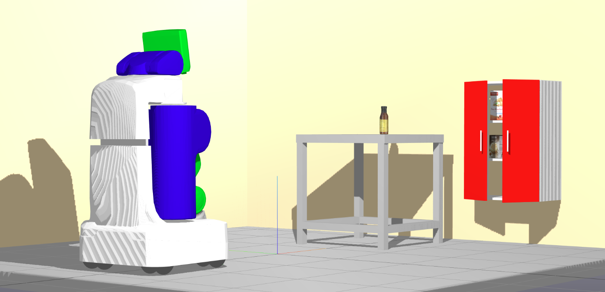

Spatial Scene Grammars
-------------




Environment generation tool using attributed stochastic scene grammars.

# Overview

See [`examples/kitchen`](examples/kitchen/README.md) for a demo of programmatically specifying a grammar
and using it to generate scenes.

## Grammar Details: Nodes and Rules

Scenes are described by a set of symbol definitions (equiv. "node" types, representing
objects and hierarchical groupings of objects) and rules (which describe how to take a nonterminal
node and generate more nodes from it). A node gets to sample a set of active rules to determine
*what* gets generated, while each rule dicatates *where* (among other continuous choices) things
get placed.

## Nodes (`src/nodes.py`)
Concretely, *nodes* are Python classes that contain information about the details of the node
(e.g. its pose, geometry, and style). Nodes can be Terminal or Nonterminal; nonterminal
nodes lead to no further children, while Nonterminal nodes have additional interface to
describe how they generate children. Specifically, nonterminal nodes contain a list of *rules* that
originate from that node, and a way to randomly sample a set of active rules to generate
children from the node. There are a provided set of
typical node types:
- AND nodes use all of their rules all the time, OR nodes use exactly
one of their rules at random, and SET nodes choose different combinations of rules in more complex 
ways.

A number of Node class mixins are available to provide additional common functionality:
the most important being
- `SpatialNodeMixin`, which specifes that the node type will have a pose.
- `PhysicsGeometryNodeMixin`, which specifies that the node will have physics and geometry
information attached, and allows registration of that geometry in a format to make interop
with my physics engine of choice ((Drake)[drake.mit.edu]) easy.


## Rules (`src/rules.py`)
*Rules* are implemented as Python classes that provide a method for constructing a child node [or set]
given the parent. A set of template rules are provided that describe the most common relationships
used in grammars:
- Deterministic and Normally-distributed relative placement
rules that place a child object at some position in the frame of the parent.
- (More to be implemented as needed.)

## Constraints
I haven't written a general interface for these yet, but demonstrate some ad-hoc constraints that I rejection sample
through in `examples/kitchen/run_grammar.py`.

### Clearance constraints

A node with `PhysicsGeometricNodeMixin` can have "clearance geometry" registered alongside
its normal visual and collision geometry. This is intended to represent the volume of space that
*that node alone* should occupy. A scene satisfies a clearance constraint if all the clearance
geometry of the scene is not penetrating. (This is demonstrated in the kitchen example.)

### Static stability and nonpenetration of geometry (TODO)

Not done at all yet. My intent is to be able to specify "container" nodes whose children
can all be asked to specify this constraint alongside containment in the container node volume:
this would mean, in practice, that I can check / try to achieve physical feasibility for each
shelf, box, etc. independently of the rest of the scene. (Easier to make one shelf feasible
at a time than do them all simultaneously.)

## Interoperation with Pyro
All random sampling used throughout the grammar spec is done with (Pyro PPL)[http://pyro.ai/]
primitives. For grammar writing, this generally means having to write your random sampling
like

```
import pyro.distributions as dist
value = pyro.sample("variable_name", dist.distribution(<dist params>))
```

where the distribution is from [this set of distributions](http://docs.pyro.ai/en/stable/distributions.html).
Variable values throughout the grammar should be torch tensors so autodiff gets
carried through.

### Why?
I suspect / hope I can leverage Pyro's rapidly expanding library of inference
routines -- as well as generally taking advantage of gradient info -- to make
scene parsing and sampling under relatively amorphous, PPL-specified constraints
work. I acknowledge it's a pretty painful startup cost, though.

## YAML+SDF Packaged Output Format

I try to stay close to [Drake model directives format](https://github.com/RobotLocomotion/drake/blob/master/multibody/parsing/README_model_directives.md),
but with a few additions. So a scene can be saved out to a YAML file (using
`serialize_scene_tree_to_yaml_and_sdfs` from `drake_interop.py`), which will produce
an output catkin package (as a directory), with a `package.xml` file, SDFs with any
primitive geometry, and a top-level YAML file specifying what model files (including
ones potentially from other packages) are included at what poses.

### Output package structure
```
<package_name>
├── package.xml [for package <package_name>]
├── scene_tree.yaml [top-level of scene tree model directive]
├── [possibly other yamls that are included into the main yaml]
├── sdf
│   ├── *.sdf
```

### Model directive YAML spec
The YAML file contains a top-level list of directives, each of which has expected required and optional fields as listed below. They describe a scene as a kinematic tree of frames, with models welded to specified frames.

Directives:
- `add_frame`: Adds a frame to the scene at a fixed offset to a parent frame.
  - `name`: Name of the frame.
  - `X_PF`: Pose and parent info for the frame.
    - `base_frame`: Name of the parent frame.
    - `rotation`: `!AngleAxis`-tagged rotation info
      - `angle` single float element
      - `axis`: 3-float-element list
    - `translation`: xyz offset as a 3-float-element list
- `add_model`: Adds given model to the scene.
  - `name`: Model name.
  - `file`: Path to SDF file.
- `add_weld`: Weldes frame (or link) `child` to frame `parent`. Usually used to weld the root link of an added model to a frame in the scene kinematic tree.
  - `parent` String frame name
  - `child`: String frame name
- `set_initial_configuration`: Sets the initial joint states of an added model.
  - `model_name`: Name of the target model
  - `q0`: Dictionary mapping joint names to their initial values.
    - `joint_name`: initial position as float
- `set_initial_free_body_pose`: Sets initial pose of a floating body.
  - `X_PF`: Pose and parent info.
    - `base_frame`: Name of the parent frame.
    - `rotation`: `!AngleAxis`-tagged rotation info
      - `angle` single float element
      - `axis`: 3-float-element list
    - `translation`: xyz offset as a 3-float-element list
  - `body_name`: Target body name (not including model name prefix).
  - `model_name`: Target model name.

### Hints for parsing
I'll supply an example parser (for testing my serialization code and as an example for users) designed to operator with Drake and link it here when it works. I suspect doing it with Pybullet should be relatively straightforward as well. These directives are meant to work in tandem with a robot simulator -- hopefully the heavy lifting of kinematic tree management, SDF loading, etc can be mostly handled by your simulator internals, with each of these commands roughly mapping to a set of initialization routines you can ask of the simulator.

# Dependencies

From pip or conda:
- `numpy`
- `matplotlib`
- `networkx`
- `pyro` and `pytorch`
- `meshcat`

Not on pip yet:
- `pydrake`: Install from [here](https://drake.mit.edu/python_bindings.html).


# Personal Notes / TODOs

Grammar setup:
- Is the complicated node / rule responsibility split worth it? It feels messy / wrong right now --
I want to enforce separation of continuous and discrete decision making, but not really for
any reason. That template rules exist and work is sort of nice, but there might be a cleaner
way.
- Same for the class mixin nonsense -- maybe I could get away without it, and just commit all
of that functionality into the base Node type (and have the system be intelligent about it being
used vs not used). Right now, it leads to nasty multiple constructor calls that are going to be
super easy to screw up, and lead to confusing bugs.
- Prior work is usually using attributed AND/OR/SET grammar. I'm currently being more flexible by
allowing more node types to be created and not forcing SET nodes to be composed out of AND and OR
nodes. This complexity might come to bite me when it comes time to write a reversible jump proposal generator...
- General way of specifying constraints would be nice.
- Currently demonstrating sampling with rejection sampling (in kitchen example). Next versions should be:
  - Spiral 1: HMC in constraint null space, something like [this](https://dritchie.github.io/pdf/hmc.pdf)?
  - Spiral 2: Alternate that with tree resampling / parsing?
- Need tree parsing first pass to figure out pain points in interop between the tree structure and Pyro.